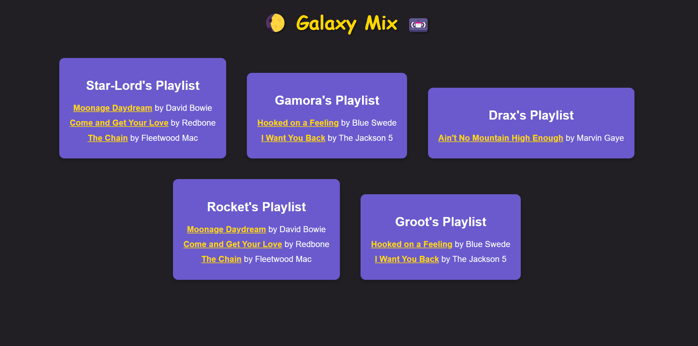

## From the Author
In this submission we used java built in functions to created and filter songs according to the preffered genre. If you love a bit of Pop, you'll love Groot's Playlist. With the use of built-in JavaScript functions, map() and filter(), a playlist is created by filtering through an array of objects (which contains the song title, artist and genre) and selecting all the songs that meet the condition. The guradians and their preferences are stored in another array of objects, the objects containing details of name, music taste and a special URL to an exisiting playlist!). 
The display makes use of a responsive grid style that shows each playlist as a card with all the music on it. 
I added special features like a linking the actual playlists to the music, where you can listen to your favourite guardians' playlist!
# [JSL05] Submission: Galaxy Playlist Generator

You will:
1. Use the provided Starter Code Repository: https://github.com/CodeSpace-Academy/Module_5_StudentNo_Classcode_Group_Name-Surname_JSL05
2. Code your solution.
3. Commit changes to your GitHub repository.
4. Submit the GitHub Repository Link to the LMS [JSL05] Submission Project Tab.

Check out the practice challenges on Scrimba here: https://scrimba.com/playlist/pXXzN5GT6

### Galaxy Playlist Generator

In this challenge, you'll combine your knowledge of JavaScript arrays and the `map()` function to create a personalized "Awesome Mix" playlist for each of the Guardians of the Galaxy. Your task is to filter and organize songs based on each Guardian's musical preference, displaying a playlist tailored just for them.

#### Instructions:

1. **Expand the Songs Array**: Add at least five songs to the `songs` array, each with `title`, `artist`, and `genre`.
2. **Assign Preferences**: Complete the `guardians` object by assigning each Guardian their preferred music genre.
3. **Generate Playlists**: Implement the `generatePlaylist` function. Use the `map()` function to create a personalized playlist for each Guardian based on their genre preference.
4. **Display Playlists**: Dynamically create and append elements to the `#playlists` div to display each Guardian's playlist. Include the Guardian's name and their list of songs.
5. **Test Your Application**: Ensure that your application correctly filters songs by genre for each Guardian and displays the playlists on the web page.

## What You Need to Do:

1. Clone the provided Starter Code Repository to your local development environment (e.g., VSCode): https://github.com/CodeSpace-Academy/Module_5_StudentNo_Classcode_Group_Name-Surname_JSL05
2. Open the cloned project in your code editor.
3. Code your solution for each of the challenges as per the provided instructions.
4. Commit your changes to your local Git repository with meaningful commit messages.
5. Push your local Git repository to your GitHub account.
6. Verify that the changes have been successfully pushed to your GitHub repository.

## What You Need to Include:

1. Ensure that your code includes the necessary modifications to meet the challenge requirements.
2. Your GitHub repository should contain the updated code files.

## How We'll Assess Your Work:

1. We will review your GitHub repository to ensure that it contains the updated code files.
2. We will assess the modifications made to the code to verify that they effectively meet the challenge requirements.
3. We will consider the commit history and meaningful commit messages to evaluate your coding process.

This challenge will test your ability to manipulate arrays and objects, use the `map()` function for data transformation, and dynamically update the DOM based on data. Good luck, and may your mix be truly awesome!

